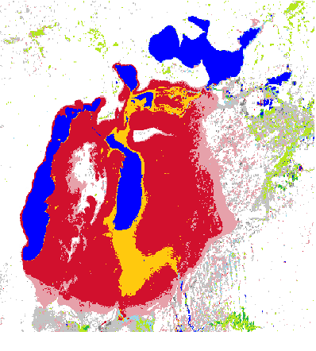

```{r setup, include=FALSE}
knitr::opts_chunk$set(echo = TRUE)
```


# Introduction
<div style="text-align: justify">
The Aral Sea (Aral Lake) is an example of a terminal lake (@Micklin.2010); A term that is used to describe water bodies with a surface inflow and no surface outflow of water. It is located in the great desert of central Asia, with Kazakhastan and Uzbekistan as its main riparian countries. Two major rivers have been identified as the main source of inflows into the Aral Sea, namely, Amu Dar’ya and Syr Dar’ya rivers (@Raskin.1992 and @Micklin.2007), therefore they influence the water level in the sea to a very great extent. The subject of changing water level in the Aral Sea has become a major topic for the scientist and non-scientist community, a report by BCC described the Aral Sea as follows “Once the fourth-largest freshwater lake in the world, the Aral Sea today is a tenth of its original size”. Several scientific publications on the subject provide a two-phase explanation for the loss of water in the sea. @Micklin.2007 argued that the first phase which is prior to 1960 results from a geological diversion of the Amu Dar’ya river and that beyond 1960 (second phase) where the Aral Lake diminished due to increase in irrigation activities within the area (@Gaybullaev.2012,). 
Associated with the shrinking of the Aral Sea, are environmental processes such as desiccation and salinization (@Gaybullaev.2012 and @Micklin.1988). @Gaybullaev.2012 puts the salinity figures as 10.0 g/L in 1957 to 42.0 g/L in 1998, and 120.0 g/L in 2009, a figure that is three times higher than the average salinity of oceans. A detailed discussion of the various ramifications of these two processes is beyond the scope of this work, it is to mention though, that desiccation which describes the loss of moisture directly translates to desertification and consequent habitat and biodiversity loss. Also, given that the Aral Sea was a freshwater lake, increasing salinity implies loss of freshwater habitat and thus endangers freshwater organism in the area. The study Area of the Aral Lake Basing is shown in figure 1 and 2.

For educational purposes this study employs the Google Earth Engine Code Editor using JavaScript to verify if the state of scientific knowledge can be accepted and reproduced by own analysis of satellite imagery.Therefore a time series model of water loss in the Aral Sea using different data sets to describe the water change intensity over time and determine certain transition classes as well as using the Normalized Differences Water Index will be created to determine and varify the development in the Aral Lake Basin. The aim also is to ascertain whether there is an increase or decrease rate of desiccation of the Aral Sea and the possible factors that mainly influence this process. 


```{css, echo=FALSE}
figure {
  display: inline-block;   
}
```

<div>
<center>
<figure>
    
    <figcaption>Figure 1: Study area 2000</figcaption>
</figure>
<figure>    
    
    <figcaption>Figure 2: Study area 2020</figcaption>
</figure>
</center>
</div>


# Current state of scientific knowledge
In recent times, several studies have been done in the region around Aral Sea for comprehensive assessment of the possible cause and effects of the shrinking water body. Argument has to a large extent implied that rise in irrigation activities along the main channel of the source rivers may be the cause of the shrinking lake, but environmental modelers have weighed in by creating various spatio-temporal models of Aral lake for better evaluation of the problem. @Tao.2020 presented several modeled results of changes in the water level, surface area and water volume of the Aral Sea from 2002 to 2018 (Figure 3). The study divided the sea into four parts and the model output reveal varied curves of changing water level and surface area of Aral Sea through time. The sectional results of the changing water level as given in the report summarily explain that there is a water level rise in the northern Aral Sea and a water level decline in the west and east Aral Sea. Similar results were also obtained by @Sun.2019.

<center>

<figure>
    
    <figcaption>Figure 3: Water level (blue) and surface area (red) changes in the four parts of the Aral Sea (a)Tchebas Bay;(b) the North Aral Sea;(c) the West Aral Sea; and (the East Aral Sea)</figcaption>
</figure>
</center>

<br>

In a single time series curve of the water surface area of Aral Sea from 1986 to 2017, @Deliry.2020 estimated a decrease from 45000km² to 10000km² of the total surface area of the Aral Sea (Figure 4). The model results by other authors also confirm the same trend in the water level and surface area of Aral Sea (@Singh.2018 and @Shi.2014). In the work of @Mu.2019, the average annual surface area changes of the southern and northern Aral Sea is seen to have an inverse relationship, as depicted by a single graph that combines the annual curves of surface area change in the southern and northern Aral Sea from the period of 2001 to 2015. The graph simply implies that for every drop in square kilometer at the south Aral Sea, there is a corresponding rise in the northern Aral Sea (Figure 5).


<center>

<figure>
    
    <figcaption>Figure 4: Single time series curve of the surface area of Aral Sea by Deliry et al., (2020).</figcaption>
</figure>
</center>

<center>

<figure>
    
    <figcaption>Figure 5: Relative surface area changes in northern and southern Aral Sea by Mu et al., (2019).</figcaption>
</figure>
</center>


<br>

In the quest to unravel the cause for shrinking Aral Sea, other studies considered climate factors that may influence the availability or lack of water supply to the Sea. @Sun.2019 analyzed the relationship between the volumetric changes of Aral Sea and precipitation, with the results showing that there is no significant impact of precipitation on the water level of Aral Sea. @Mu.2019, also considered elevation and temperature, but the larger argument, as mentioned in our introduction attributes the cause of shrinking Aral to increased human activities in the area.


# Methodology, Code and Results

Environmental remote sensing studies employ the use of remotely sensed data from satellites and sensors such as Landsat to delineate changes in the environment (@Weng.2009). These sensors are able to capture and store images from subsurface, and ground surface of the land as well as water bodies and the atmosphere. According to @Melesse.2007 sensors employed in remote sensing comprises of “a wide range of spatiotemporal, radiometric and spectral resolutions”. Landsat 7 which was launched on 15th April 1999 (@Goward.2001) carries an Enhanced Thematic mapper (ETM+) sensor (@Melesse.2007). Its main purpose is to ensure that a cloud-free seasonal coverage of the globe is recorded and archived (@Goward.2001), the data of Landsat satellites are stored in pixels comprising of different bands and wavelengths which allows ecologist and environmental scientist to extract useful information on environmental trends by selective combinations of bands from Landsat image. One of such methods is known as Normalized difference water index (@McFEETERS.1996).
Normalized difference water index (NDWI) is a remotely sensed method for analyzing water resources (@McFEETERS.1996), and is an improvisation on the Normalized difference vegetation index (NDVI) (Jain.2020; @McFEETERS.1996 and @Gu.2008). Whereas NDVI assess above-ground biomass and primary productivity (@An.2013), NDWI is tailored for water assessment both for quality and quantity. Both methods are derived by simple mathematical of selected bands. NDVI combines bands that delineates the presence of vegetation by outputting index values that range from zero (bare ground) to one (vegetated surface) but does extend to the negative. Since open water features have negative index values, using the same principle as in NDVI, the NDWI is calculated using bands combination that is inclusive of the negative index value range as follows

$$
NDWI = (NIR - SWIR) / (NIR + SWIR)
$$
<center>
*SWIR (Short-Wavelenght-Infrared); NIR (Near-Infrared)* <br>
For Landsat 7 this is given as:
</center>
$$
NDWI = (Band 4 – Band 5) / (Band 4 + Band 5)
$$
In this study, Landsat 7 database on google earth engine is used to generate a times series model of water loss in the Aral Sea with the application of NDWI method of remote sensing analysis. 


## Google Earth Engine and Java Scrip
Google Earth Engine is a cloud-based platform for planetary-scale geospatial analysis using a multi-petabyte catalogue of satellite imagery, geospatial datasets and huge computational capabilities of the Google LLC enterprise allowing besides other purposes for scientific researches and analysis regarding important societal issues such as deforestation, desertification, drought, disease, food security, changes in water levels or surface area, climate change and environmental protection.

Google Earth Engine enables users to compute on petabytes of data on the fly without having to navigate through the complexities of cloud computing and cloud-based programming. The programming is done via the Google Earth Engine JavaScript API and allows users to run algorithms on georeferenced satellite imagery and vectors which are stored within the cloud. The Google Earth Engine API also provides a library with a variety of functions and commands and a public data catalogue which contains many pre-processed datasets that can be used for further analysis. The actual programming is done in the Code Editor whose central component is a JavaScript editor which is an interactive environment for developing Earth Engine applications 

JavaScript is a programming language that allows dynamic content updates, animated images and is alongside with HTML and CSS one of the core technologies of the Word Wide Web. It is a high-level language which means that the level of abstraction is high, it is often used for just-in-time compilation and is considered to be multi-paradigm programming language since it supports event-driven, functional and imperative programming styles. Originally JavaScript was developed in 1995 from Netscape for dynamic HTML in web browsers, but is now increasingly used for other software systems such as servers and a variety of applications such as the JavaScript API in the Google Earth Engine.


In order to analyse the water surface area changes over time different approaches to access the desired data from satellite imagery were tried. It is necessary to mention at this point that the following scripts and codes were created in an educational context with the aim to study remote sensing, satellite imagery analysis and JavaScript in the Google Earth Engine Editor and are due to the circumstances neither complete nor correct and some problems could not be solved in this work. In this context please find and run a generated script for calculating the NDVI (Normalized Differences Vegetation Index) in the Aral Lake area <a href=https://code.earthengine.google.com/3b66f0860f1d217bbb1668d053af231a>**here**</font></a>.


## Calculation and Visualisation of Water Occurance, Water Change Intensity and Transition Classes in the Aral Lake Basin from 1984 - 2015

<br>

### Method

For the calculations and visualizations for water occurrence and transition classes the JRC Global Surface Water Mapping Layers v1.0 data set was used. This data set contains information about the spatial and temporal distribution of surface water in the time period from 1984 - 2015. These data were generated using scenes from the landsat 5, 7, and 8 satellite which were recorded between 16th March 1984 and 10th October 2015. A classification of each pixel into water or non-water has already been applied using an expert system which produced a monthly history in surface water change for the entire time period stored different information in several bands @Pekel.2016. This approach contains the setting of appropriate visualization parameters, selection of desired information as bands (water occurrence, change intensity and transition class), creating a function that creates a feature for the transition classes in the respective area, create a JSON dictionary that defines the pie chart colours based on the transition class palette, creating a dictionary with the pie chart names and colours, generating a histogram that shows the occurrence of changes in surface water area, adding the pie chart with the transition classes to the console and adding the maps with the water occurrence and water pixels with a 90% threshold in occurrence, the water change intensity and the water transition. The maps where then exported as GeoTIFF files and implemented in this report. ALso a filtering process to define different time periods and display the possible differences was attempted. Find and run the following script in the Google Earth Engine Code Editor <a href=https://code.earthengine.google.com/34b87303f55416fcc31d002d9f12b009>**here**</font></a>.


### Code
Since the code folding for JavaScript did not work the code was implemented as R code which is responsible for the wrong highlighting.

```{r, eval = FALSE}
///////////////////////////////////////////////////////////////
///////////////////////////////////////////////////////////////
//Water Surface Area of the Aral Lake//////////////////////////
///////////////////////////////////////////////////////////////
///////////////////////////////////////////////////////////////
//import dataset//
///////////////////////////////////////////////////////////////
var gsw = ee.Image('JRC/GSW1_0/GlobalSurfaceWater');
print(gsw, 'gsw');

var roi = 
    /* color: #98ff00 */
    /* shown: false */
    /* displayProperties: [
      {
        "type": "rectangle"
      }
    ] */
    ee.Geometry.Polygon(
        [[[57.91985937500002, 46.93522519500926],
          [57.91985937500002, 43.707555725336775],
          [62.27044531250002, 43.707555725336775],
          [62.27044531250002, 46.93522519500926]]], null, false);

///////////////////////////////////////////////////////////////
//select Layer//
///////////////////////////////////////////////////////////////
var occurrence = gsw.select('occurrence').clip(roi);
var change = gsw.select("change_abs").clip(roi);
var transition = gsw.select('transition').clip(roi);
print(transition, 'transition');

///////////////////////////////////////////////////////////////
//set styling parameters//
///////////////////////////////////////////////////////////////
var VIS_OCCURRENCE = {
  min:0,
  max:100,
  palette: ['red', 'blue']
};

var VIS_CHANGE = {
    min:-50,
    max:50,
    palette: ['red', 'black', 'limegreen']
};

var VIS_WATER_MASK = {
  palette: ['white', 'black']
};


//////////////////////////////////////////////////////////////
//helper functions//
//////////////////////////////////////////////////////////////
// Create a feature for a transition class that includes the area covered.
function createFeature(transition_class_stats) {
  transition_class_stats = ee.Dictionary(transition_class_stats);
  var class_number = transition_class_stats.get('transition_class_value');
  var result = {
      transition_class_number: class_number,
      transition_class_name: lookup_names.get(class_number),
      transition_class_palette: lookup_palette.get(class_number),
      area_m2: transition_class_stats.get('sum')
  };
  return ee.Feature(null, result);   // Creates a feature without a geometry.
}

// Create a JSON dictionary that defines piechart colors based on the
// transition class palette.
// https://developers.google.com/chart/interactive/docs/gallery/piechart
function createPieChartSliceDictionary(fc) {
  return ee.List(fc.aggregate_array("transition_class_palette"))
    .map(function(p) { return {'color': p}; }).getInfo();
}


//////////////////////////////////////////////////////////////
//calculations//
//////////////////////////////////////////////////////////////

// Create a dictionary for looking up names of transition classes.
var lookup_names = ee.Dictionary.fromLists(
    ee.List(gsw.get('transition_class_values')).map(ee.String),
    gsw.get('transition_class_names')
);
// Create a dictionary for looking up colors of transition classes.
var lookup_palette = ee.Dictionary.fromLists(
    ee.List(gsw.get('transition_class_values')).map(ee.String),
    gsw.get('transition_class_palette')
);

// Create a water mask layer, and set the image mask so that non-water areas
// are transparent.
var water_mask = occurrence.gt(90).mask(1);

// Generate a histogram object and print it to the console tab.
var histogram = ui.Chart.image.histogram({
  image: change,
  region: roi,
  scale: 30,
  minBucketWidth: 10,
  maxPixels: 1e9
});
histogram.setOptions({
  title: 'Histogram of surface water change intensity.'
});
print(histogram);

// Summarize transition classes in a region of interest.
var area_image_with_transition_class = ee.Image.pixelArea().addBands(transition);
var reduction_results = area_image_with_transition_class.reduceRegion({
  reducer: ee.Reducer.sum().group({
    groupField: 1,
    groupName: 'transition_class_value',
  }),
  geometry: roi,
  scale: 30,
  bestEffort: true,
});
print('reduction_results', reduction_results);

var roi_stats = ee.List(reduction_results.get('groups'));

var transition_fc = ee.FeatureCollection(roi_stats.map(createFeature));
print('transition_fc', transition_fc);

// Add a summary chart.
var transition_summary_chart = ui.Chart.feature.byFeature({
    features: transition_fc,
    xProperty: 'transition_class_name',
    yProperties: ['area_m2', 'transition_class_number']
  })
  .setChartType('PieChart')
  .setOptions({
    title: 'Summary of transition class areas between 1984 and 2015',
    slices: createPieChartSliceDictionary(transition_fc),
    sliceVisibilityThreshold: 0  // Don't group small slices.
  });
print(transition_summary_chart, '1984 - 2015');

//create filter for 1984 - 2000 and 2000 - 2015
var filtered2000 = transition_fc.filterDate('1984-01-01', '2000-12-31');
print(filtered2000, 'filtered2000');

// Add a summary chart.
var transition_summary_chart1 = ui.Chart.feature.byFeature({
    features: filtered2000,
    xProperty: 'transition_class_name',
    yProperties: ['area_m2', 'transition_class_number']
  })
  .setChartType('PieChart')
  .setOptions({
    title: 'Summary of transition class areas between 1984 and 2015',
    slices: createPieChartSliceDictionary(transition_fc),
    sliceVisibilityThreshold: 0  // Don't group small slices.
  });
print(transition_summary_chart1, '1984 - 2000');


////////////////////////////////////////////////////////////
//create maps with center on Aral Lake//
////////////////////////////////////////////////////////////
Map.setCenter(59.414, 45.182, 6);

//add map that shows water occurrence
Map.addLayer({
  eeObject: occurrence.updateMask(occurrence.divide(100)),
  name: 'Water Occurance (1984 - 2019)',
  visParams: VIS_OCCURRENCE 
});

//add map that shows the water pixels with a 90% treshhold in occurrence
Map.addLayer({
  eeObject: water_mask,
  visParams: VIS_WATER_MASK,
  name: '90% occurrence water mask'
});

//add map that shows the intensity of water change
Map.addLayer({
  eeObject: change,
  visParams: VIS_CHANGE,
  name: 'occurrence change intensity'
});

//add map that shows water transition
Map.addLayer({
  eeObject: transition,
  name: 'Transition classes (1984-2015)',
});


Export.image.toDrive({
  image: transition,
  description: 'transition',
  region: roi,
  scale: 30,
  maxPixels: 1e13,
});

```


### Results
A Map with four different Layers namely the “Water Occurrence (1984 - 2019)”, “90% occurrence water mask”, “occurrence change intensity” and "Transition Classes (1984 - 2015) could be produced. The Water Occurrence (1984 - 2019) layer shows how much of the time a pixel was classified as water (Figure 6). With this it can be determined if an area is permanently covered with water over the entire time period. The 90 % occurrence water mask shows in which areas the occurrence of water was greater than 90 % but is not further displayed here and can be seen in the original Google Earth Engine layer output. 

```{r, fig.align="center", fig.cap="*Figure 6: Water occurrence in the Aral Lake basin in the periode from 1984 to 2019 in percent*"}
library(sp)
library(raster)
occurrence <- raster("results/AralLakeTIFF/occurrence.tif")
spplot(occurrence)
```

<br>

The change intensity of the totality of pixels is shown in a histogram that shows the amount of change in surface water area in percent in relation to the amount of pixels for which these change apply (Figure 7). The histogram shows clearly that the most frequent case is a loss in surface water area of 80 - 90 % followed by a gain in water surface area of 0 - 10 %. Overall the area with loss in surface water highly dominates which is also reflected in the Map that shows where the water change intensity is highest (Figure 8).

<center>
<figure>
    
    <figcaption>Figure 7: Frequency of change in surface water area per pixel in the time period of 1984 - 2019 in the Aral Lake basin</figcaption>
</figure>


</center>


```{r, fig.align="center", fig.cap="*Figure 8: Water change intensity in percent in the Aral Lake basin in the period from 1984 to 2019*"}
library(sp)
library(raster)
change <- raster("results/AralLakeTIFF/change.tif")
spplot(change)
```

<br>

The Transition Classes (1984 - 2015) layer classifies specific regions of the area as certain transition classes in the time period of 1984 until 2015 and displays them in different colours (Figure 9). The occurrence of these transition classes is also displayed as a pie chart where the different assignments of colours to the transition classes can be seen as well as their occurrence in percent (Figure 10). It can be seen that almost 50 % of the surface water area is lost permanently, that there are seasonal changes to consider and only around 18 % of the area is covered permanently with water. The differentiation in two time periods from 1984 to 2000 and from 2000 to 2015 failed and the attempt to filter the feature collection returns an error which could not be solved.

<br>

<center>



</center>

<br>

<center>


</center>

<br>

## Calculating the NDWI (Normalized Differences Water Index) for the Aral Lake area

### Method

For the calculations and visualizations of the NDWI data from the atmospherically corrected surface reflectance ETM+ sensor of the Landsat 7 satellite was used. The provided images contain four visible and near-infrared (NIR) bands as well as two short-wave infrared (SWIR) bands processed to orhtorectified surface reflectance and one thermal infrared (TIR) band that is processed to orthorectified brightness temperature. The for this work important NIR and SWIR bands have a resolution of 30m / pixel. In this attempt a cloud masking was implemented to find the least cloudy images. And some images were visualized and exported for display. The NDWI was calculated as described earlier and visualization parameters have been applied.The images for the years 2000, 2005, 2010, 2015 and 2020 were exported as GeoTIFF files and then converted to png images for implemantation in the report. Also the values for the NDWI were plotted over time and the results were exported as a csv file. The values were then plotted in R with a linear trend to see the development over time. Find and run the following script in the Google Earth Engine Code Editor <a href=https://code.earthengine.google.com/a2c9a36f17ece6f1c1fc50c6bb8e0c0c>**here**</font></a>.


### Code
Since the code folding for JavaScript did not work the code was implemented as R code which is responsible for the wrong highlighting.

```{r, eval=FALSE}
var vizParams = {"bands":["B3","B2","B1"],"min":0,"max":3000,"gamma":1.4},
    aral = 
    /* color: #d63000 */
    /* shown: false */
    /* displayProperties: [
      {
        "type": "rectangle"
      }
    ] */
    ee.Geometry.Polygon(
        [[[58.136254409271096, 46.968235679890654],
          [58.136254409271096, 43.95642171601016],
          [62.124291518646096, 43.95642171601016],
          [62.124291518646096, 46.968235679890654]]], null, false);
// cloud masking
var cloudMaskL457 = function(image) {
  var qa = image.select('pixel_qa');
  // If the cloud bit (5) is set and the cloud confidence (7) is high
  // or the cloud shadow bit is set (3), then it's a bad pixel.
  var cloud = qa.bitwiseAnd(1 << 5)
                  .and(qa.bitwiseAnd(1 << 7))
                  .or(qa.bitwiseAnd(1 << 3));
  // Remove edge pixels that don't occur in all bands
  var mask2 = image.mask().reduce(ee.Reducer.min());
  return image.updateMask(cloud.not()).updateMask(mask2);
};

// loading Landsat7 surface reflectance and filter for NDWI
var aral_lake = ee.ImageCollection('LANDSAT/LE07/C01/T1_SR')
                  .filterDate('2015-01-01', '2015-12-31')
                  .map(cloudMaskL457);


var aral2020 = aral_lake.median().clip(aral); 
print(aral2020, 'Aral Lake')

// Map Visualisation 
// View the median composite
Map.setCenter(59.974, 45.728, 7);
Map.addLayer(aral2020, vizParams, 'collectiion');


// Create visualization layers.
var imageRGB = aral2020.visualize({
  bands: ['B3', 'B2', 'B1'],
  gamma: 1.4,
  min: 0,
  max: 3000
});

// Print a thumbnail to the console.
print(ui.Thumbnail({
  image: imageRGB,
  params: {
    dimensions: '256x256',
    region: aral,
    format: 'png'
  },
  style: {height: '300px', width: '300px'}
}));


// Create an NDWI image, define visualization parameters and display.
var ndwi = aral2020.normalizedDifference(['B3', 'B5']);
var ndwiViz = {min: 0.5, max: 1, palette: ['00FFFF', '0000FF']};
Map.addLayer(ndwi, ndwiViz, 'NDWI', false);

// Mask the non-watery parts of the image, where NDWI < 0.4.
var ndwiMasked = ndwi.updateMask(ndwi.gte(0.4));
Map.addLayer(ndwiMasked, ndwiViz, 'NDWI masked');

var ndwiRGB = ndwiMasked.visualize({
  min: 0.5,
  max: 1,
  palette: ['00FFFF', '0000FF']
});


//Export the image, specifying scale and region.
Export.image.toDrive({ 
  image: ndwiRGB,
  description: 'ndwiRGB2015',
  scale: 30,
  maxPixels: 1e10,
  region: aral
});


//Plot NDWI
//variable in time and NDWI
var addVariables = function(image) {
    var ndwi = image.normalizedDifference(['B4', 'B5']).rename('ndwi');
    return image.addBands([ndwi]);
} 
  var startDate = '2000-01-01';
  var endDate = '2020-12-31';
// loading Landsat7 surface reflectance and filter for NDWI
var Modis = ee.ImageCollection('LANDSAT/LE07/C01/T1_SR')
                  .filterDate('2010-01-01', '2010-12-31')
                  .filterBounds(aral)
                  .map(cloudMaskL457)
                  .map(addVariables);
                 
// Plot NDWI ---------------------------------------------------------------------------------------------// Remove clouds, add variables and filter to the area of interest.
var chart = ui.Chart.image.series({
    imageCollection: Modis.select('ndwi'), 
    region: aral,
    reducer: ee.Reducer.mean(), //type of reduction. See ee.Reducers for other kinds of reductions
    scale: 250, //spatial scale of MODIS product
    }).setOptions({
      interpolateNulls: true,
      lineWidth: 1,
      pointSize: 3,
      title: 'NDWI Landsat7',
      vAxis: {title: 'NDWI'},
      hAxis: {title: 'Date', format: 'YYYY-MMM', gridlines: {count: 12}}
    });
print(chart);
```


### Results


<div>
<figure>
    
    <figcaption>Figure 11: Year 2000</figcaption>
</figure>
<figure>    
    
    <figcaption>Figure 12: Year 2005</figcaption>
</figure>
</div>


<div>
<figure>
    
    <figcaption>Figure 13: Year 2010</figcaption>
</figure>
<figure>    
    
    <figcaption>Figure 14: Year 2015</figcaption>
</figure>
</div>

<div>
<figure>
    
    <figcaption>Figure 15: Year 2020</figcaption>
</figure>
<figure>    
    
    <figcaption>Figure 16: NDWI values over time</figcaption>
</figure>
</div>


## Calculation of the surface water area over time in the Aral Lake basin

### Method
For the calculations and visualizations of the water area the JRC Monthly History v1.2 data set was used. This data set contains information about the spatial and temporal distribution and provides statistics on the extent of change of surface water in the time period from 1984 - 2019. These data were generated using scenes from the landsat 5, 7, and 8 satellite which were recorded between 16th March 1984 and 31th December 2019. A classification of each pixel into water or non-water has already been applied using an expert system which produced a monthly history in surface water for the entire time period. In this approach the attempt was to create a function that calculates the pixel area multiplied by the amount of pixels that have been classified as water, map it over the whole image collection and finally get a line chart with the water surface area over time as an output. Find and run the following script in the Google Earth Engine Code Editor <a href=https://code.earthengine.google.com/4244bc8424bd0f8eb82213d97ea9306a>**here**</font></a>.


### Code
Since the code folding for JavaScript did not work the code was implemented as R code which is responsible for the wrong highlighting.

```{r, eval=FALSE}
var roi = 
    /* color: #009999 */
    /* displayProperties: [
      {
        "type": "rectangle"
      }
    ] */
    ee.Geometry.Polygon(
        [[[57.96380468750002, 46.93522519500926],
          [57.96380468750002, 43.659886266041504],
          [62.00677343750002, 43.659886266041504],
          [62.00677343750002, 46.93522519500926]]], null, false);
var water_history = ee.ImageCollection('JRC/GSW1_2/MonthlyHistory')
                    .filterBounds(roi);
print(water_history, 'water_history');


// water function:
var waterAreafunction = function(image){
  //add band to the image
  var water = image.select('water');
  //get pixels that are masked as water with '2' in roi
  var class2 = ee.Image(1).mask(image.select('water').eq(2).clip(roi));
  //calculate pixelArea
  var area = ee.Image.pixelArea();
  //multiply pixel area by number of pixels that were masked as water
  var waterArea = class2.multiply(area);
  //add Band with values of water area per image to image
  return image.addBands(waterArea);
};


//map function over ImageCollection
var WaterArea = water_history.map(waterAreafunction);
print(WaterArea, 'WaterArea');

//create a time series chart of water surface area 
var chart = ui.Chart.image.series({
  imageCollection: WaterArea.select('constant'), 
  region: roi, 
  scale: 200,
  xProperty: 'system:index'
});
print(chart);

//visualisation
var visualization = {
  bands: ['water'],
  min: 0.0,
  max: 2.0,
  palette: ['ffffff', 'fffcb8', '0905ff']
};

Map.setCenter(59.414, 45.182, 6);
Map.addLayer(water_history, visualization, 'Water');
```


### Results
A line chart could be produced (Figure 17). A meaningful interpretation is however not possible. There have been numerous issues during the calculation and creation of the function that could not be solved in this effort. It was however implemented in this report to show it nonetheless and mention that the work just on this attempt took about 30 - 40 hours.
<center>


</center>
<br>


# Discussion

The analysis for water occurrence in the lake (Figure 6), revealed that highest water occurrence in the Aral Sea as of 2019 are within the northern Aral, western Aral, and a small section of the eastern Aral. The main bulk of the changes in intensity of water was observed in the southern Aral Sea with little or no changes in the northern Aral (@Yang.2020). The reason for minimal loss of water in the northern Aral Sea, has not been fully explained in previous studies. Naturally, small bodies of water should dry up faster than larger bodies of water, ironically, the time series trend of water loss in the Aral Sea has shown more water lost over time in the southern Aral Sea than in the northern Aral Sea, even though the southern is way bigger in surface area than the northern Aral, even as @Aladin.2019 named them “Large Aral” and “small Aral” respectively. Possible cause for this trend could be differences in elevation. @Mu.2019 observed an increase in the surface area and elevation of the Northern Aral Sea from 2001 to 2015 and decrease in surface area and volume of southern Aral Sea within the same time frame.  It may also be interesting to test for the variation in human activities in the northern and southern Aral regions as most studies have attributed water loss in the Aral Sea to large scale irrigation and damming activities (@Wang.2020; @Oberhansli.2007; @Micklin.2010). The study further indicates that over 70% of water loss in the Aral Sea are permanent losses, while the other 30% are accounted as seasonal and transitional losses. according to @Roget.2017, the present Aral Sea is just about 10% of its former volume and size in 1960.
The desiccation of Aral Sea from 2000 to 2020 as summarily captured in figures 11 – 15, confirms that most of the area covered by water has been lost, in the image for 2020 (figure 15), only a trace of what is known as western Aral Sea, which is the biggest of the split portions of the Sea is visible. The NDWI plot (Figure 16), display higher band concentration below the zero value. From studies, this implies less water availability in the area, as the general NDWI values range from +1 to -1, values less than zero is interpreted as “a period of water stress” a term which is used in the European Drought Observatory (EDO) fact sheet as “low vegetation water content and low vegetation fraction cover”. Clearly from the regression line in (figure 16), we can say that the NDWI values in the study area has been decreasing over time, confirming the fact that there has been a loss of water in the area.

Lastly it is to mention that the speed of decrease in surface water area could not be determined in this attempt. In General some problem while using JavaScript could not be solved in this effort. For example the exact water area calculation failed due to incorrect codes or calculation methods. Furthermore several issues using the Google Earth Engine Editor caused problems in accessing this task. Also the code folding option in Rmarkdown for JavaScript did not work and the table of content shows a dublicate of chapter 2 and 3 and also performs inadecuately, even though the code should be correct. We would like to mention again that this work was done with a clear educational assignment, therefore we would like this report to be understood in this way rather than apply our conclusions in a scientific context or retriev our findings. Much more, this work tought us a great deal about working with JavaScript, Google Earth Engine, remote sensing, raster data, Rmarkdown, Markdown, HTML and R as well as the handling of GeoTIFF files, image conversion and compression and data wrangling in general. Thanks a lot for all the advice.


# References
</div>